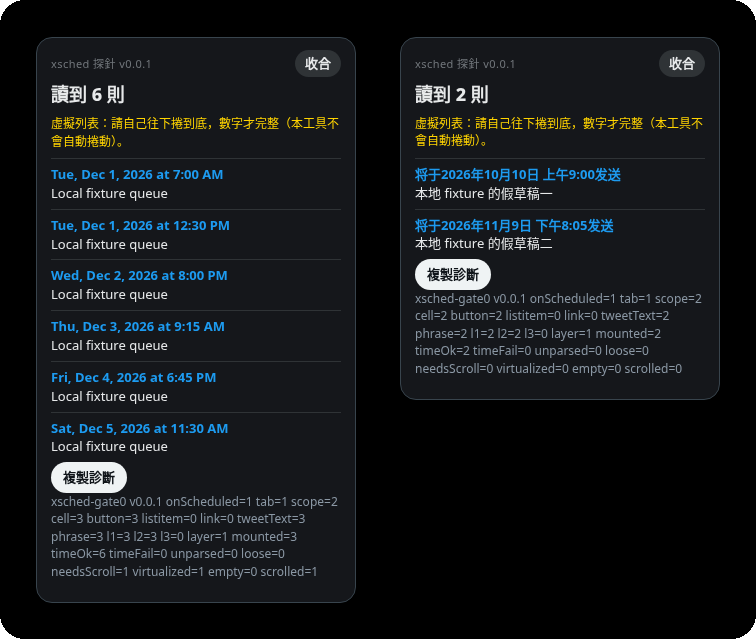
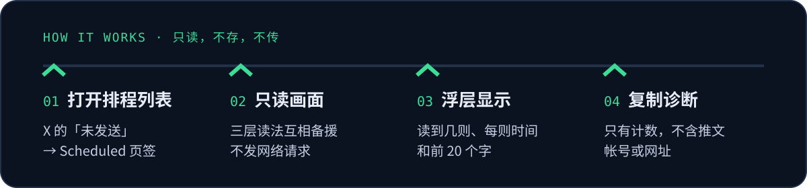
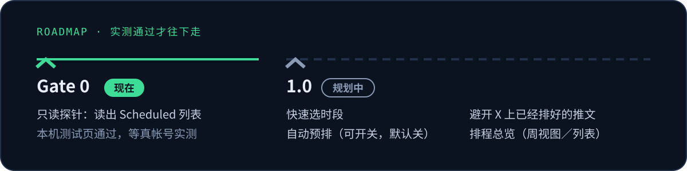

<p align="center">
  
</p>

<p align="center">
  <b>Chrome 扩展：直接在 x.com 页面上帮你操作 X 自带的「排程」。</b><br>
  不用 API、不发网络请求、不会自己发文。推文一律由 X 原生排程送出。
</p>

> [!IMPORTANT]
> **目前只有 Gate 0 只读探针。** 它只会读出你在 X 上已经排好的推文，还不能帮你排程。下面写着「规划中」的功能都还没做，要等探针在真帐号上实测通过才开工。

## 现在能用的：Gate 0 探针

<p align="center">
  
</p>

<p align="center"><sub>端到端测试的截图：本机测试页上的示例数据，依公开资料重建，不是真实的 X 页面或帐号。左边是自己往下滚之后累加到 6 则，右边是简体中文的时间写法。</sub></p>

打开 X 的排程列表时，探针会在右下角放一个浮层（浮层文字目前是繁体中文）：

- **「讀到 N 則」**：数出画面上的排程推文。X 的列表是边滚边载入的，所以要你自己滚到底，数字才完整；探针不会替你滚。
- **每则的时间和前 20 个字**：方便你对照 X 上显示的是否一致。
- **「複製診斷」**：按下才复制一行诊断，只有计数和版本号，不含推文内容、帐号或网址。读不出来时，把这行贴回来就知道是哪一步出问题。
- **五种界面语言的时间写法**：英文、日文、简体中文、繁体中文、韩文。日文的写法有公开实机资料可对照，其他几种是推测的。

## 原则：只读、不存、不传

<p align="center">
  
</p>

- **不用任何 API**：不调用 X 官方 API，也不连我们自己或任何第三方服务器。
- **零网络请求**：不用 `fetch`、XHR、`sendBeacon`、WebSocket、EventSource。`npm run verify` 会把这些写法挡掉，端到端测试也确认扩展本身发出的请求是 0。
- **零权限**：manifest 里没有任何 `permissions`，也没有 host 权限。内容脚本只在 `x.com` 和 `twitter.com` 上运行。
- **不存资料**：探针不用 storage，读到的内容只留在当前页面的内存里，关掉就没了。
- **不会自己发文**：现在只读；以后的版本也只是帮你打开、填好 X 自带的排程窗口，最后由你按下 Schedule、由 X 发出。

## 安装探针

还没上架 Chrome Web Store，先用开发者模式载入：

1. 下载本仓库，或解压拿到的探针 zip。
2. 打开 `chrome://extensions`，开启右上角「开发者模式」。
3. 点「加载已解压的扩展程序」（Load unpacked），选 `probe/` 文件夹。
4. 打开 <https://x.com/compose/post/unsent/scheduled>，也可以从发文窗口的排程图标进去，点左下角「Scheduled posts」。
5. 右下角会出现浮层。把列表自己滚到底，对照则数和时间，再按「複製診斷」，把那一行贴回来。

## 路线

<p align="center">
  
</p>

**1.0（规划中，Gate 0 实测通过才开工）**

- **快速选时段**：发文框旁边加按钮，预设几个常用时段，可以自定义、可以按星期设。按一下就打开 X 的排程窗口，填进「下一个空时段」，你确认后照原流程按 Schedule。
- **自动预排**（可开关，默认关）：打开后，按「发文」会改走排程，自动填进下一个空时段。
- **避开已经排好的推文**：空时段会对照 Gate 0 读到的 X 排程列表，不只看这台电脑记过什么。现有的同类扩展都读不出 X 上已经排了什么，这是 xsched 想补上的空缺。
- **排程总览**：用周视图或列表看所有已排推文的时间和开头文字，点一下跳到 X 上那一则去编辑。
- **找不到会提示**：读不到排程窗口或列表时，面板会明确警告，并保留复制诊断的按钮。

上架商店之后再决定。

## 已知限制

- **还没在真的 X 页面上验证过。** 我们不登录 X，读法是照公开资料和本机测试页写的；能不能在你的帐号上读出来，要靠实测确认。
- **繁体中文、简体中文、韩文的时间写法和页签名称是推测的。** 浮层如果是 0 或整个不出现，告诉我们你的界面语言和页签上的字，我们再补。
- **列表要自己滚到底。** 累加的则数不是即时的准确总数；同一画面里编辑或删除过的，可能还留着旧的那一则，重新进入列表就会重读。
- **时间和全文完全相同的两则会被当成一则。**
- **只有图片或影片、没有文字的推文可能读不到。**
- **排程窗口本身（快速选时段要用的）不在 Gate 0 范围内**，这一阶段只读列表。

## 开发

```bash
npm install
npm test          # reader 解析：五种语言、三层备援、去重累加、诊断不含内容
npm run verify    # 权限和网络请求守门，含会抓违规的 self-test
npm run e2e       # Chrome for Testing 载入真 probe/，本机测试页模拟 X
```

`npm run e2e` 需要 Xvfb，并用 `CHROME_PATH` 指向 Chrome for Testing。所有测试都只用本机测试页，不登录任何帐号。

## 文件

- [`AGENTS.md`](AGENTS.md)：接手这个仓库的工作规矩和要跑的测试
- [`docs/plan/ROADMAP.md`](docs/plan/ROADMAP.md)：路线图和目前进度
- [`notes/GATE0.md`](notes/GATE0.md)：Gate 0 的读法、依据来源、改版风险和实测步骤
- 示例截图：[`docs/gate0-en.png`](docs/gate0-en.png)、[`gate0-ja.png`](docs/gate0-ja.png)、[`gate0-zh-Hans.png`](docs/gate0-zh-Hans.png)、[`gate0-zh-Hant.png`](docs/gate0-zh-Hant.png)、[`gate0-ko.png`](docs/gate0-ko.png)、[`gate0-roles-fallback.png`](docs/gate0-roles-fallback.png)、[`gate0-empty.png`](docs/gate0-empty.png)、[`gate0-virtual-before.png`](docs/gate0-virtual-before.png)、[`gate0-virtual-after.png`](docs/gate0-virtual-after.png)
- 标志：[`docs/xsched-logo-B.svg`](docs/xsched-logo-B.svg)，用的是符文 Dagaz，意思是「日子」，整体轮廓是一个封起来的 X

## 授权

这是公开仓库，但目前还没有授权文件。在加上授权之前，保留所有权利（all rights reserved）。
